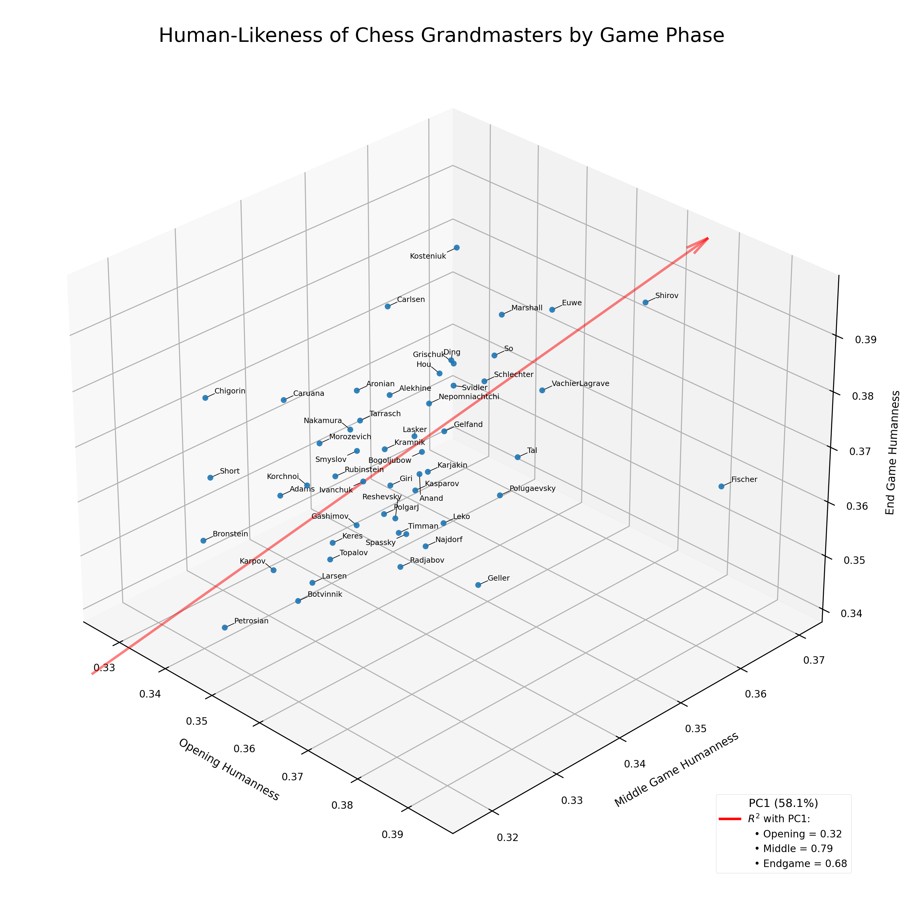
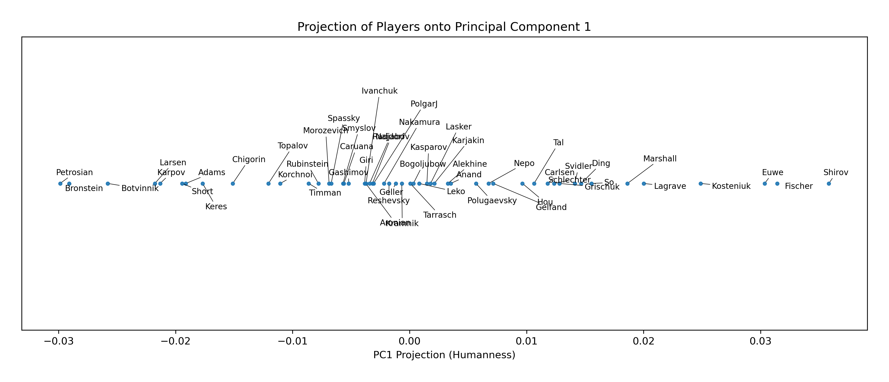

# Human-Likeness in Chess

A small research project quantifying how "human-typical" famous chess grandmasters play, using [Maia-2](https://arxiv.org/abs/2409.20553), a deep-learning model trained exclusively on human games to predict what a player at a given rating would do in any position.

**[→ Interactive visualisation + write-up](https://mattiagreiche.github.io/chess-behaviour-snapshot/)**


## What it does

I ran Maia-2 on 18,000 moves per grandmaster (opening, middlegame, endgame) and recorded the probability the model assigned to each player's actual move. That probability is the "human-likeness" score: high means the move was typical of how humans (at that skill level) play, low means it was more unusual.

Plotting each player as a point in (opening, middlegame, endgame) human-likeness space reveals a strong latent structure: a single axis (PC1) explains **~58%** of the variance, and it runs consistently across all three phases.

***Note**: The trend is better visualized through the interactive 3D plot. Click the image to open the website.*

[](mattiagreiche.github.io/chess-behaviour-snapshot/)

And here are those values collapsed onto PC1 (least to most human-like):



## Key findings

- **One latent axis dominates.** A single "human-likeness" dimension accounts for the majority of variance across all three game phases, which is non-trivial given how different opening theory, middlegame tactics, and endgame technique are.

- **Orthogonal to skill and era.** Peak ELO and era of play both show essentially zero correlation with human-likeness (R² ≈ 0.009 and 0.016). High human-likeness is not just "weaker player" or "older era."

- **Acts as a fingerprint.** Compressing each player down to three humanness values preserves enough identity signal that a k-NN classifier re-identifies players from held-out games at ~55% top-5 accuracy (vs. 9% random baseline).


## Reproducing the results

All scripts are run from the project root:

```bash
# 1. Download PGN files (~65 grandmasters from pgnmentor.com)
python -m pipeline.fetch

# 2. Parse PGNs and segment moves by game phase (cached after first run)
python -m pipeline.parse

# 3. Run Maia-2 inference on training moves (slow)
python -m pipeline.inference

# 4. Visualise
python -m analysis.plot_interactive     # → outputs/plot_means_interactive.html
python -m analysis.plot_means           # → outputs/regression_means_plot.png
python -m analysis.plot_pc1             # → outputs/pc1_projection.png

# 5. Stylometric verification (cached after first run)
python -m analysis.stylometry_3d
python -m analysis.stylometry_6d
```
Cached files are already present in the repo.


## Dependencies

```
pip install -r requirements.txt
```

## License and Usage

All rights reserved. I'm sharing this repository publicly as part of my portfolio to showcase my current progress and methodology. Since this is an ongoing, unpublished project, I kindly ask that you do not copy or reuse the code or findings just yet. If you're interested in the project or want to discuss the approach, feel free to reach out!

---

*Mattia Greiche — mattia.greiche@mail.mcgill.ca*
